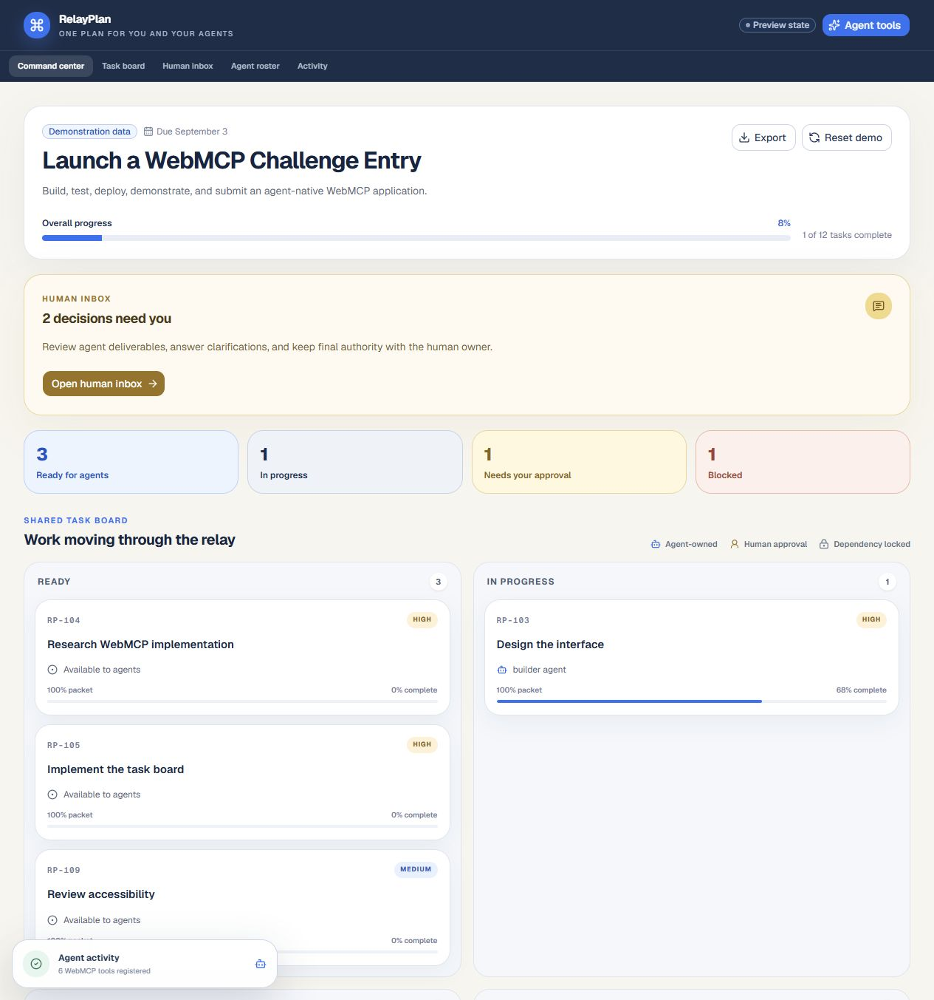
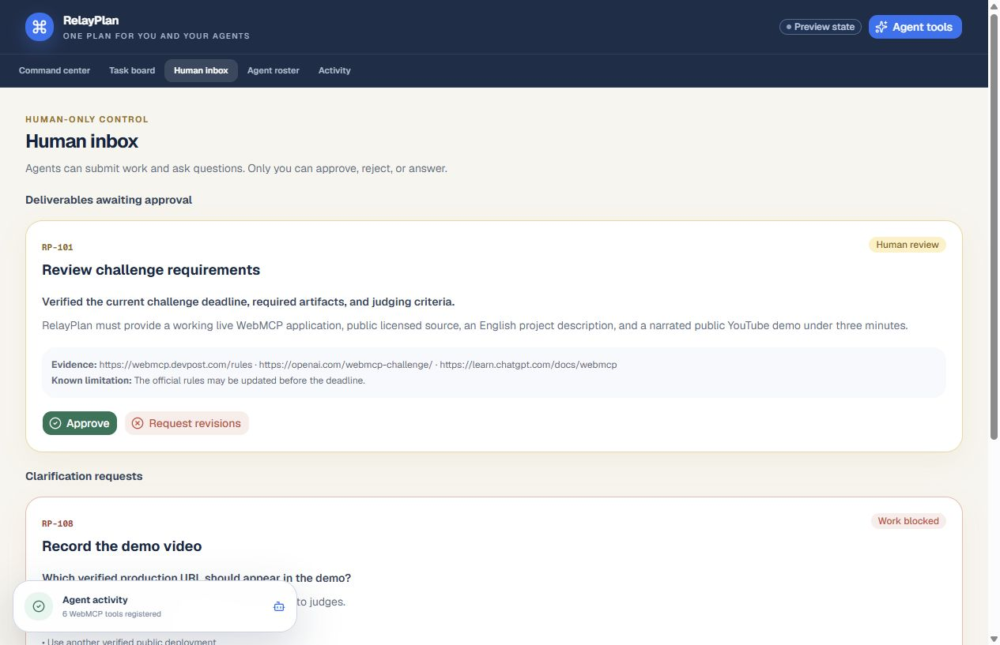
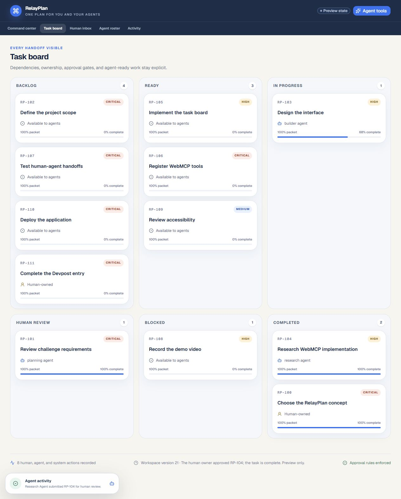
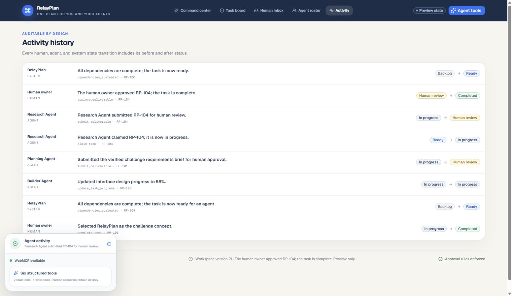

# RelayPlan

**One plan for you and your agents.**

RelayPlan is a shared WebMCP project control center for human tasks, agent assignments, task packets, dependencies, progress, clarification requests, deliverables, approvals, and auditable handoffs. Agents can discover and execute structured work from the page. Humans retain the final authority to approve or reject it.

**Live app:** [relayplan-webmcp.alx21.chatgpt.site](https://relayplan-webmcp.alx21.chatgpt.site)



## Screenshots

| Human approval inbox | Completed handoff and dependency unlock |
| --- | --- |
|  |  |



## Why RelayPlan

Ordinary planners do not tell an agent which work is truly ready, which context is required, or where human approval is mandatory. RelayPlan turns the visible project board into a safe, structured agent interface. Its WebMCP tools mutate the same durable workspace the person sees, so a claim, progress note, blocker, clarification, or deliverable is immediately visible and auditable.

## WebMCP tools

RelayPlan feature-detects `document.modelContext` (with the compatible navigator fallback) and registers six tools exactly once:

| Tool | Mode | Purpose |
| --- | --- | --- |
| `get_workspace_context` | Read | Summarize goals, progress, tasks, approvals, agents, activity, and workspace version. |
| `list_ready_tasks` | Read | Return claimable work after dependency, capability, packet, and capacity checks. |
| `claim_task` | Write | Assign an eligible Ready task and move it to In Progress. |
| `update_task_progress` | Write | Record progress, time, blockers, and missing information. |
| `submit_deliverable` | Write | Save evidence-backed work and move it to Human Review, never Completed. |
| `request_human_input` | Write | Create a clarification and optionally block the task. |

Approval, rejection, revision requests, and clarification answers are deliberately absent from the agent tool surface.

## The demonstration

The seeded workspace, **Launch a WebMCP Challenge Entry**, includes four coordination profiles, Ready work, dependency-locked work, work in progress, a deliverable awaiting approval, a blocker, a clarification, and recent audit events. Demonstration data is explicitly labeled in the interface.

The core flow is:

1. An agent reads the workspace and lists Ready tasks.
2. It claims eligible work and receives the complete task packet.
3. It records progress or asks the human for missing context.
4. It submits a deliverable with evidence and limitations.
5. The human approves or rejects in the Human Inbox.
6. Approval completes the task, unlocks eligible dependencies, and records the full handoff.

## Local development

Requirements: Node.js 22.13 or newer and pnpm.

```bash
pnpm install
pnpm dev
```

Open `http://localhost:3000`. A standard WebMCP-capable browser exposes the page-side tools; the planner remains usable when WebMCP is unavailable.

## Verification

```bash
pnpm lint
pnpm typecheck
pnpm test
pnpm build
```

The unit suite covers domain rules, closed runtime validation, approval boundaries, dependency unlocks, audit events, and the six-tool registration contract. See [docs/TEST_PLAN.md](docs/TEST_PLAN.md) for live verification.

## Deployment

RelayPlan is a Vinext/React application deployed through ChatGPT Sites with a Cloudflare D1 binding named `DB`. The workspace is stored as one versioned JSON aggregate and updated with optimistic concurrency. See [docs/DEPLOYMENT.md](docs/DEPLOYMENT.md).

## Documentation

- [Architecture](docs/ARCHITECTURE.md)
- [WebMCP tools and judge prompts](docs/WEBMCP_TOOLS.md)
- [Test plan](docs/TEST_PLAN.md)
- [Demo script](docs/DEMO_SCRIPT.md)
- [Devpost submission copy](docs/DEVPOST_SUBMISSION.md)
- [Submission checklist](docs/SUBMISSION_CHECKLIST.md)

## License

[MIT](LICENSE) © 2026 RelayPlan contributors.
