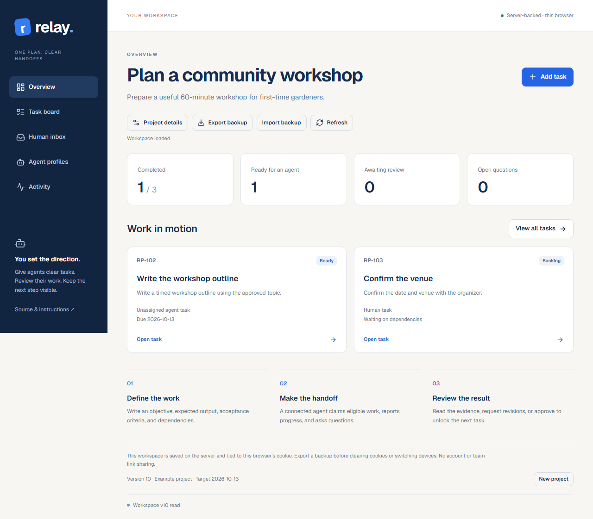

# Relay

**One plan for you and your agents.**

Relay is a project workspace for turning a goal into tasks, handing structured work to an agent, and reviewing the result. Create your own project and tasks, track dependencies, answer questions, request revisions, and approve deliverables. Human tasks can be completed directly with a recorded result.

**[Open Relay](https://relay.alx21.chatgpt.site)** · Free to use · [MIT license](LICENSE)



## Start with your own work

1. Open Relay and choose **Project details**. Set a name, goal, and optional target date.
2. **Add task**. Include the objective, context, expected output, definition of done, deadline, and any dependencies. Choose a human or agent owner.
3. Open a human task and record its result with **Mark complete**. For an agent task, connect an agent through a WebMCP-capable browser, or use **Assign task** to record an assignment manually.
4. Review submissions and questions in **Human inbox**. Read the complete content, evidence, and limitations before approving. Request revisions with feedback when needed.
5. **Export backup** regularly. Use **Import backup** to restore the project in another browser or device. Restore and **New project** replace the current project only after confirmation.

**Explore an example** loads a three-task community workshop plan. It contains no fabricated deliverables or progress. You can edit or delete unclaimed tasks; tasks with dependents must be removed from those dependencies before deletion.

## What actually happens

- Eligible agent work must have a complete task packet, completed dependencies, no assignment, and a matching profile with available capacity. Capability names are case-sensitive; an empty profile capability list is general-purpose, and tasks without labels accept any available profile.
- Claiming a task records an assignment. Progress notes and questions appear immediately in the same board used by the person.
- A blocking question stays blocking until answered. Other unanswered blocking questions and separately reported progress blockers remain in force.
- Submitting a deliverable moves work to **Human review**. Approval completes it and unlocks dependencies; revisions return it to **In progress** with feedback preserved.
- The page tools return saved database results. A failed request is reported as an error and never replaced with an unsaved pretend success.

Relay **does not launch agents, call a language-model API, perform external work, verify evidence URLs, or run background jobs**. A connected agent does the task using its own tools and submits the result. Profile names are assignment labels, not authenticated identities. You can perform every task operation through the ordinary browser UI even when WebMCP is unavailable.

## Your workspace and backups

Each browser receives a separate workspace stored in the server's Cloudflare D1 database. An HttpOnly cookie selects it; there is no account, team invitation, or shareable workspace link. Tabs in the same browser share the workspace. Click **Refresh** to see another tab's changes; stale edits are rejected instead of overwriting saved work.

- Data is **server-stored**, not offline or end-to-end encrypted.
- Clearing the cookie, using a different browser profile, or allowing it to expire can remove your access. The cookie is renewed on workspace reads for up to one year. Keep exported JSON backups; there is no account recovery.
- Import validates structure, references, dependencies, and workflow states before replacing your project. The destination keeps its own browser identity.
- Limits: 100 tasks, 20 agent profiles, 200 clarification requests, 200 progress notes per task, 50 deliverables per task, and 900 KB of serialized workspace data. The latest 100 activity events are retained. These are small-project limits, not unlimited storage.
- Human review is a workflow convention. Anyone or any software using the same browser session can use the UI or its API. Omitting approval from the six agent tools is not a separate authentication boundary.

Older shared example rows are not used by this release. The update leaves those rows intact and starts each visitor with a separate empty workspace.

## WebMCP tools

Tools register after the saved workspace loads, when `document.modelContext` or `navigator.modelContext` is available. Registration is removed when the component unmounts. You do not need an API key for Relay itself.

| Tool | Purpose |
| --- | --- |
| `get_workspace_context` | Read the project, profiles, full task packets, progress, deliverables, reviewer feedback, and pending **and answered** questions. |
| `list_ready_tasks` | Find eligible tasks, optionally narrowed by profile and capabilities. |
| `claim_task` | Assign an eligible task to an available profile. |
| `update_task_progress` | Record progress from 0–99%, time, and current blockers. |
| `request_human_input` | Ask a question, with an explicit choice about whether work can continue. |
| `submit_deliverable` | Submit content, evidence, limitations, and a recommended next step for review. |

Example instruction for your connected agent:

> Read my Relay workspace, find a task for the planning-agent profile, and claim it. Use the task packet and supplied references to do the work. Ask me if something essential is missing. Submit the actual result with evidence and limitations for review.

This is page-side WebMCP, not a standalone remote MCP server. Browser support is required for agent tool discovery. [Tool contract and examples](docs/WEBMCP_TOOLS.md).

## Run locally

Requires **Node.js 24+** and **pnpm 11.19.0**. No provider API key is needed.

```sh
git clone https://github.com/agammann/relay-webmcp.git
cd relay-webmcp
pnpm install --frozen-lockfile
pnpm build
pnpm start --port 3013
```

Open `http://localhost:3013`. Wrangler runs the built Worker and a local D1 database under `.wrangler/`. It does not connect to the public site's production database. `pnpm dev` is available for development with the Cloudflare Vite runtime. Static file hosting alone cannot run this app.

```sh
pnpm test
pnpm lint
pnpm typecheck
pnpm exec playwright install chromium
pnpm build
pnpm test:e2e
```

Browser tests run the actual built Worker with local D1. Their WebMCP registration harness exercises the page handlers; it does not substitute for checking native discovery in a supporting browser. CI runs the same checks on Linux and uploads failure traces.

## Project layout

- `lib/rules.ts`: task transitions, dependencies, capacity, and history.
- `lib/validation.ts` / `lib/backup.ts`: strict action and backup validation.
- `lib/session.ts` / `lib/database.ts`: browser workspace selection and versioned D1 writes.
- `lib/client.ts` / `lib/tools.ts`: one saved state shared by UI and page tools.
- `components/relay-workspace.tsx`: task, review, profile, and backup controls.
- `e2e/`: complete handoffs, ordinary UI use, persistence, browser isolation, conflicts, errors, and mobile checks.

[Architecture](docs/ARCHITECTURE.md) · [Deployment](docs/DEPLOYMENT.md) · [Verification](docs/TEST_PLAN.md) · [Security policy](SECURITY.md)
